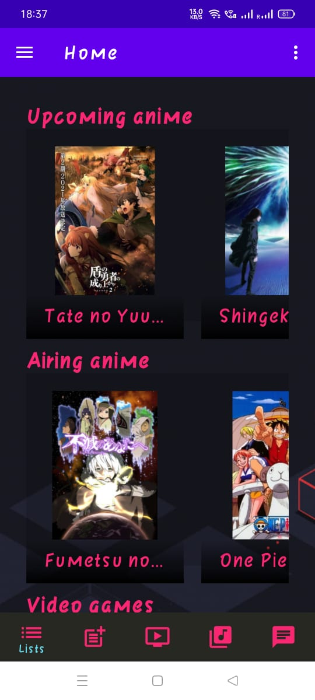
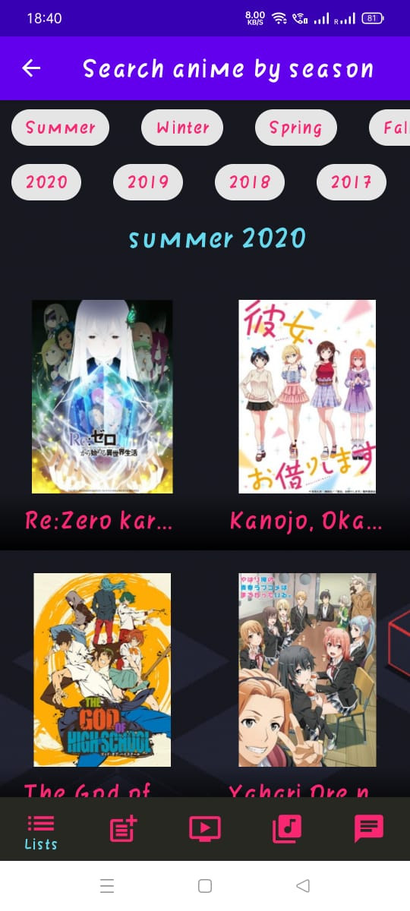
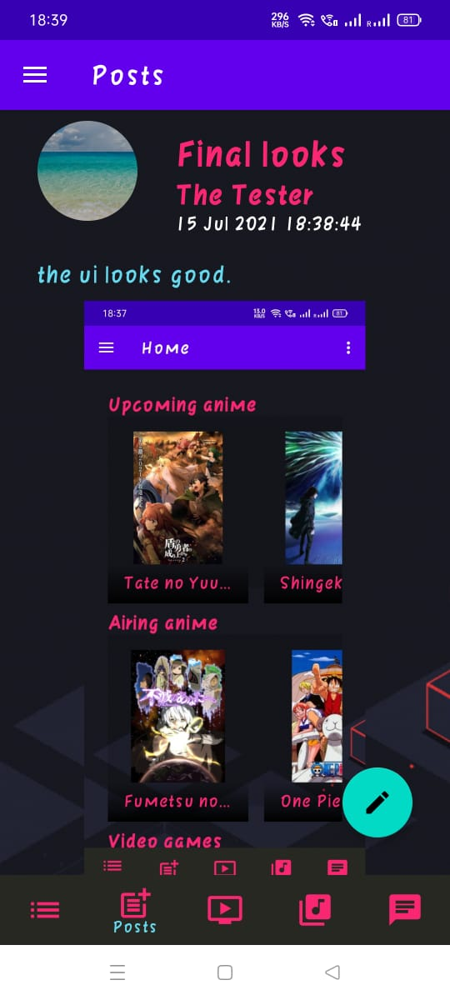
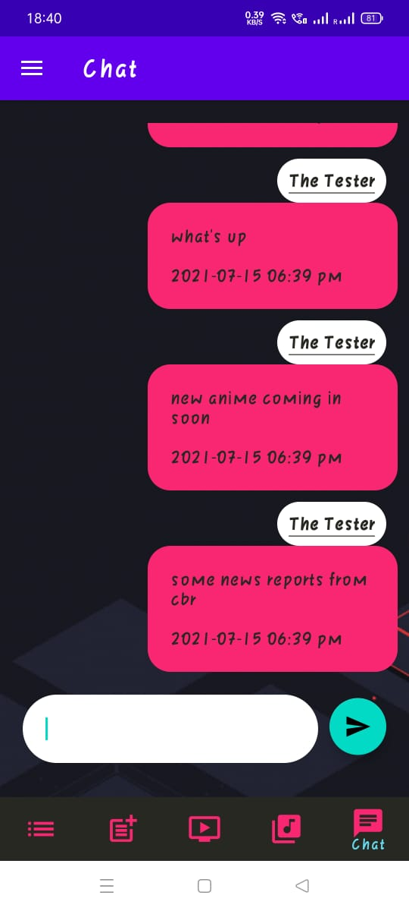
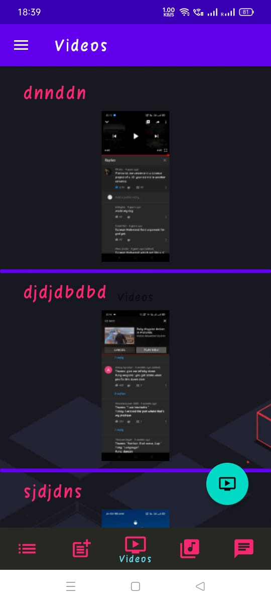

# IsThisAHangoutFinal

A mobile application built for anime enthusiasts to look for new upcoming anime and
currently airing anime. Offline first app that implements pagination using Paging 3
and Room database combined using a remote mediator. Also features a blog post
system and video sharing.

Tech Stack  - 
* Paging 3 Library
* Retrofit
* Remote Mediator
* Network Bound Resource
* Kotlin Coroutines and Flow
* Livedate
* Room Persistance Library
* Firebase 
* Glide Library

  &nbsp
   

 
 

  
   

 
 

  

